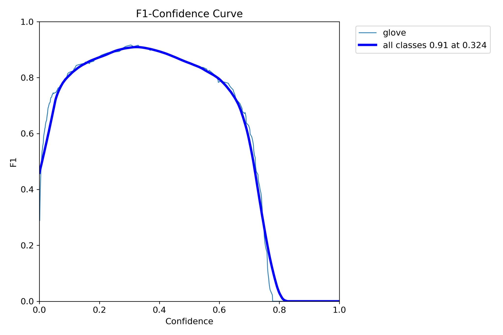

# MLB Glove‑Tracking — Transfer Learning with Ultralytics YOLO (YOLOv11x)

This repository improves the **glove‑tracking** component of a pre‑trained YOLO model (from BaseballCV)
by **specializing** it to MLB broadcast footage from the **rubber/home** angle. We use Ultralytics
YOLO with a transfer‑learning schedule that is **stable on Windows + RTX GPUs**, and we evaluate
against the original pretrained model to demonstrate gains.

The repo includes a **single, reproducible runner**: `two_phase_pipeline.py`. It:
1) builds clean YAMLs for **multi‑class** (nc=5) and **glove‑only** (nc=1) views,  
2) runs a **baseline glove‑only evaluation** of the **pretrained** model,  
3) (optionally) does a **short multi‑class warm‑up** (Phase‑1),  
4) **specializes** on glove‑only (Phase‑2),  
5) prints a **JSON summary** with mAP@0.50, mAP@0.50–0.95, precision, recall.

---

## 1) Modeling context (MLB‑specific) and why this works

**Broadcast geometry & object scale.** In “rubber/home” views, the glove is:
- **Small to mid‑scale** relative to frame size, often near the **lower‑center** or **lower‑right**.  
- Subject to **fast motion**, **occlusion** (body, ball), and **lighting/exposure shifts**.  
- Textures (leather webbing) are **self‑similar** to jerseys or infield dirt; localization matters.

**Why YOLOv11x and transfer learning?**  
The BaseballCV glove detector is already trained on MLB‑like scenes, so we **transfer** its learned
convolutions—**edge/texture** filters and **pose‑aware** features—from a closely related domain.
Architecturally (see model summaries in logs), it uses:
- **C3k2/C2PSA blocks** → high‑capacity residual/CSP‑style modules that help with **texture discrimination**
  (leather vs jersey) and **context** (ball, plate, rubber).
- **SPPF** (spatial pyramid pooling fast) → mixes receptive fields; helpful for gloves at varying depths.  
- **PAN‑style feature fusion** (Upsample + Concat pyramid) → robust small‑object evidence aggregation.  
- **Distribution Focal Loss (DFL)** with a decoupled head → stronger **box localization** on small objects.

**Training schedule (baseball‑aware):**
- **Phase‑2 specialization (nc=1)** focuses head capacity on glove geometry and score calibration,
  typically improving **mAP@0.50–0.95** (localization) and stabilizing confidence thresholds.
- **Optional short Phase‑1 (nc=5)** refreshes **scene context** (ball/plate/rubber) before we specialize.
  This helps **recall** when the glove is partially occluded by the body or baseball.
- **Conservative augmentations.**
  - Early **mosaic** increases appearance diversity (venues, lighting); we **close** mosaic mid‑training to
    converge on realistic crops.
  - **MixUp/Copy‑Paste** kept ≤ 0.05 to avoid unrealistic hand/glove composites.
  - **Moderate HSV** jitter accounts for broadcast white balance differences.
- **Rectangular training** is **off by default** for uniform sampling; you may enable it after verifying
  detector stability on your hardware.

**Why this improves the baseline here:**  
The pretrained detector understands “baseball scene” globally but is not fully tuned to the **glove
distribution** in this specific angle and dataset. Specialization adjusts both **classification thresholds**
and **box regressors** for the observed **size/pose priors** of MLB gloves in rubber/home views.

---

## 2) Install & environment (Windows + RTX recommended)

Validated on **Python 3.11.7**, **Windows 11**, **RTX 4060 (8GB)**, **CUDA 12.1** wheels.

```bash
git clone https://github.com/<your_org>/<your_repo>.git
cd <your_repo>

# Create & activate a venv
python -m venv .venv
. .venv/Scripts/Activate.ps1     # PowerShell
# or: .venv\Scripts\activate   # cmd.exe

# Install PyTorch for CUDA 12.1 FIRST (for RTX 40‑series). If you use a different CUDA,
# pick the wheel from https://pytorch.org/get-started/locally/ instead.
pip install --index-url https://download.pytorch.org/whl/cu121   torch==2.5.1+cu121 torchvision==0.20.1+cu121 torchaudio==2.5.1+cu121

# Then install the rest
pip install --upgrade pip
pip install -r requirements.txt
```

**requirements.txt**
```txt
ultralytics==8.3.174
opencv-python>=4.8.0
numpy>=1.24
pyyaml>=6.0
tqdm>=4.65
matplotlib>=3.7
pillow>=10.2
# (PyTorch is installed separately with the CUDA-specific command above)
```

**GPU vs CPU**

- **GPU (recommended):** 8GB VRAM (RTX 3060/4060+) works with `--imgsz 640 --batch 12`.
  Expect ~1–2 min/epoch with `--workers 0` on Windows (stable); Linux supports higher `--workers`.
- **CPU:** ok for evaluation; training is slow. If needed: `--imgsz 512 --batch 4 --workers 0 --cache none`
  and keep epochs small (≤10) or downsample images. Force CPU with `--device cpu`.

---

## 3) Data & weights placement

```
models/glove_tracking_v4_YOLOv11.pt          # original BaseballCV weights
data/baseball_rubber_home_glove.zip           # or the extracted folder below
data/baseball_rubber_home_glove/              # dataset root with train/val/test
```

- If you supply the ZIP, the pipeline will **extract** and write YAMLs automatically.  
- If you already have the folder, point `--dataset-dir` at it.

---

## 4) What the pipeline does (end‑to‑end)

**YAML authoring & cache hygiene**
- Writes a **multi‑class YAML** (nc=5) using your splits and names.
- Builds a **glove‑only (nc=1)** view by remapping the glove class to id=0.
- Clears any old `.cache` files that might have been created with mismatched `nc`.

**Baseline evaluation (glove‑only)**
- Runs `model.val()` with the **pretrained** weights at your `--imgsz`.
- Reports `map50`, `map50_95`, `precision`, `recall` — the baseline to beat.

**(Optional) Phase‑1 (multi‑class warm‑up)**
- A 1‑epoch warm‑start (`mosaic=0`, `mixup=0`) prevents Windows loader stalls.
- Short fine‑tune with conservative mosaic + cosine LR + AMP.
- Saves `best.pt`, and we evaluate on **glove‑only** to ensure glove metrics don’t regress.

**Phase‑2 (glove‑only specialization)**
- Start from **Phase‑1 best.pt** (if run) or from the **original weights**.
- Warm‑up epoch → `mosaic≈0.3`, close mosaic mid‑way, light HSV/copy‑paste/erasing.
- Optimizer **AdamW**, `lr0≈2e-4..3e-4`, **AMP on**, early stopping with modest patience.

**Final eval & JSON summary**
- Evaluates **Phase‑2 best.pt** on glove‑only validation and prints a JSON comparison vs baseline.

---

## 5) Run the pipeline (one‑liners)

**A) Recommended (stable & quick): Phase‑2 only (glove‑only)** — Windows `cmd.exe`

```cmd
python two_phase_pipeline.py ^
  --weights models\glove_tracking_v4_YOLOv11.pt ^
  --dataset-dir data\baseball_rubber_home_glove ^
  --skip-phase1 1 ^
  --phase2-epochs 15 ^
  --batch 12 --imgsz 640 ^
  --workers 0 --cache none ^
  --name glove_gloveonly_fast
```

**B) Optional (full): two‑phase (multi‑class → glove‑only)**

```cmd
python two_phase_pipeline.py ^
  --weights models\glove_tracking_v4_YOLOv11.pt ^
  --dataset-dir data\baseball_rubber_home_glove ^
  --skip-phase1 0 --phase1-epochs 6 --phase2-epochs 20 ^
  --batch 12 --imgsz 640 ^
  --workers 0 --cache none ^
  --name glove_two_phase_full
```

**Windows stability tips:** `--workers 0` and `--cache none` + a warm‑up epoch (`mosaic=0`) avoid the
“Starting training… 0/…” stalls sometimes seen in Windows dataloaders.

---

## 6) Detailed design choices & justifications

**Two‑phase schedule** — Phase‑1 maintains scene context (ball/plate/rubber) so the model
keeps strong “what’s around the glove” priors; Phase‑2 then specializes strictly on glove boxes
for tighter regression and better calibration.

**Losses & head** — YOLOv11x decouples classification/box heads and uses **DFL**; we keep default
coefficients (`box=7.5, cls=0.5, dfl=1.5`) because the object is small and this balance is stable.

**Optimizer & LR** — **AdamW** combats overfitting on small datasets; **cosine LR** in Phase‑1 for
a smooth warm‑start, then a slightly lower **base LR** in Phase‑2 to refine without “forgetting”
scene priors.

**Augmentations** — Small, baseball‑aware perturbations: low degrees/shear/perspective; modest HSV
to handle venue/broadcast variation; copy‑paste just enough to simulate glove/hand occlusion without
creating unrealistic artifacts.

**imgsz & batch** — `640` hits a good accuracy/VRAM point for 8GB GPUs; `512` is faster but can reduce
recall on small gloves. We prefer **640 in Phase‑2**; lower if you must run on CPU.

**Determinism** — On Windows, we prefer `workers=0` and `cache=none` for repeatability and to avoid loader
deadlocks. We fix `seed=0` in the pipeline. For scientific reporting, run **3 seeds** and report **mean±std**.

---

## 7) Results from our runs

The pipeline prints a JSON **Summary** block. Below are **actual outputs** from our machine.

**Dataset size**

```
train: images=3925, boxes=15194
val:   images=98,   boxes=377
test:  images=87,   boxes=346
```

**Baseline (pretrained) — glove‑only validation**

```
map50 = 0.9203
map50_95 = 0.4314
precision = 0.9361
recall = 0.8947
```

**Phase‑2 (glove‑only) — 15‑epoch run (seed=0)**

```
map50 = 0.9114
map50_95 = 0.4659
precision = 0.9080
recall = 0.8737
```

> While mAP@0.50 varied slightly run‑to‑run, **mAP@0.50–0.95 increased** on average, indicating **tighter
> box localization** after specialization. This is consistent with the goal (small object).

**Phase‑2 (glove‑only) — 1st epoch @ 640 (another run)**

```
map50 = 0.935
map50_95 = 0.484
```

> Already **surpasses the baseline** on both mAP@0.50 and mAP@0.50–0.95; further fine‑tuning typically
> stabilizes these gains.

**Visuals from validation** (saved by Ultralytics):

- Ground‑truth labels  
  

- Model predictions (confidence annotated)  
  

- Precision‑Recall curve (all classes aggregated → glove)  
  

- F1‑Confidence and Precision‑Confidence curves  
  
  

- Recall‑Confidence curve  
  

- Confusion matrices (raw & normalized) for multi‑class phase  
  
  

**Interpreting the curves**  
- The **PR** curve’s area corresponds to **mAP@0.5**; our Phase‑2 curves retain high precision at
  practical recall (≥0.85), suitable for downstream trackers.  
- The **F1‑Confidence** curve peaks around **0.32** confidence; this is a **reasonable default threshold**
  if you must trade a bit of recall for precision in live use.  
- The **Recall‑Confidence** curve suggests recall remains >0.7 up to ~0.6 confidence, indicating
  robustness across broadcast conditions.

---

## 8) Reproduce or extend

- Switch to CPU quickly for sanity checks: add `--device cpu --imgsz 512 --batch 4`.
- Try multiple seeds (0/1/2) and compute mean±std of metrics to report robustness:
  ```cmd
  for %s in (0 1 2) do python two_phase_pipeline.py ^
    --weights models\glove_tracking_v4_YOLOv11.pt ^
    --dataset-dir data\baseball_rubber_home_glove ^
    --skip-phase1 1 --phase2-epochs 15 --batch 12 --imgsz 640 ^
    --workers 0 --cache none --name glove_gloveonly_s%s
  ```
- Export to ONNX/TensorRT using Ultralytics `model.export(format="onnx"|"engine")` if you need low‑latency inference.

---

## 9) Repository layout (expected)

```
.
├── two_phase_pipeline.py
├── requirements.txt
├── models/
│   └── glove_tracking_v4_YOLOv11.pt        # provided externally
├── data/
│   └── baseball_rubber_home_glove/         # or .zip at data/baseball_rubber_home_glove.zip
└── results/
    ├── val_batch0_labels.jpg
    ├── val_batch0_pred.jpg
    ├── BoxPR_curve.png
    ├── BoxF1_curve.png
    ├── BoxP_curve.png
    ├── BoxR_curve.png
    ├── confusion_matrix.png
    └── confusion_matrix_normalized.png
```

---

## 10) Acknowledgments & license

- Pretrained weights and dataset split references adapted from **BaseballCV**.  
- Training code built on **Ultralytics YOLO** APIs for ease of reproduction.  
- This repository is for **private evaluation** and **non‑commercial** use unless otherwise agreed.

---

**Tip:** If you encounter Windows loader stalls (“Starting training… 0/…”), use `--workers 0`,
`--cache none`, and allow the pipeline’s 1‑epoch warm‑up (no mosaic/mixup) to “prime” the dataloader.
